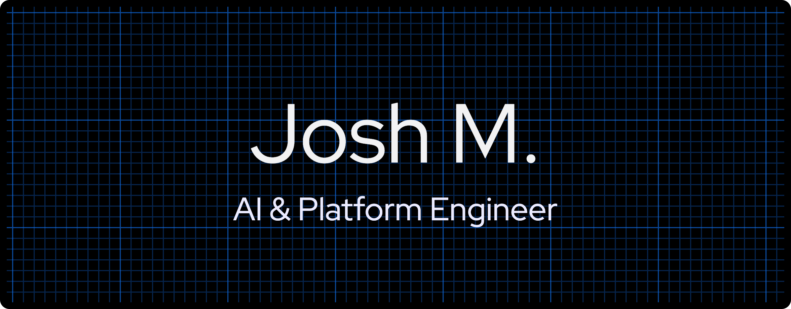

  

# Josh Menzies  
**AI & Platform Engineer**  
_Cloud • DevOps • Reliability Engineering_

---

### 🧭 About Me  
Engineer working at the intersection of **AI, cloud infrastructure, and automation**.  
I design scalable systems that self-observe, self-heal, and make teams faster and calmer.

Currently exploring how **machine learning and platform engineering** can merge to create intelligent, self-tuning infrastructures.

---

### ⚙️ Core Competencies  
**Cloud & DevOps** — AWS · GCP · Terraform · Kubernetes · Docker  
**Automation & CI/CD** — Jenkins · GitHub Actions · IaC workflows  
**AI & Systems** — LLMOps · OpenAI API · Hugging Face · TensorFlow  
**Observability & Reliability** — Datadog · Prometheus · Grafana

---

### 🧩 Featured Work  
- **[WhisperNote](#)** — Voice-to-text with live tone analysis _(Swift, CoreML)_  
- **[Opsy](#)** — AI-powered SRE colleague for automated reliability insights  
- **[CI/CD Project](#)** — Scalable build pipelines with Terraform & Jenkins  
- **[Velocity Cube](#)** — Experimental logic engine & visualizer in JavaScript  
- **[Shua.ai](https://shua-ai.vercel.app)** — Personal lab for AI × Automation experiments  

---

### 🌍 Connect  
[LinkedIn](https://www.linkedin.com/in/josh-m123456) · [Website](https://shua-ai.vercel.app)

---

### 💡 Philosophy  
> “Automate what you can, understand what you must.”  
Always building at the edge of reliability, simplicity, and intelligence.
