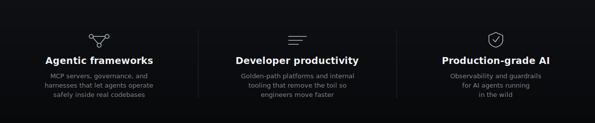

 

**Platform Engineer** &nbsp;·&nbsp; **AI Developer Enablement** &nbsp;·&nbsp; New York

 

### I build the layer where AI agents meet production

Agentic systems, MCP servers, and developer-productivity tooling that turn 
agents into teammates that actually ship — safe, observable, fast enough to trust.

 

 

### Stack

&nbsp;

&nbsp;

Build in the open &nbsp;·&nbsp; Own the layer

