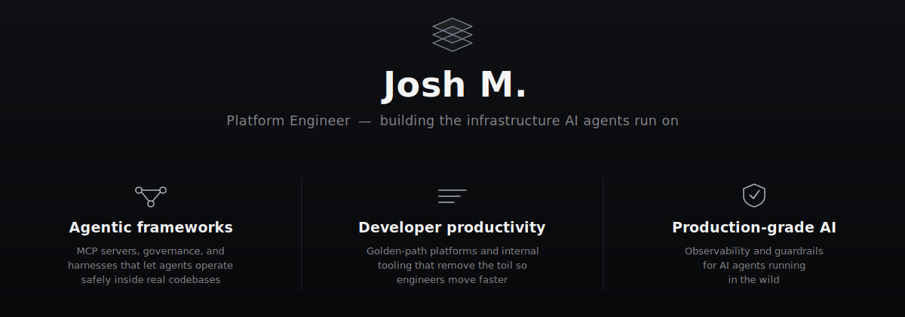

 

<b>Explore below ↓</b>

 

<b>&nbsp;&nbsp;Featured work</b>

 

**[AWS Architect MCP](https://github.com/jmenzies722/aws-architect-mcp)** &nbsp;·&nbsp; MCP · TypeScript
Turns an AI agent into an AWS solutions architect — selects a reference pattern from a goal, then emits production-grade Terraform, IAM policy, and cost estimates.

**[Forge](https://github.com/jmenzies722/forge)** &nbsp;·&nbsp; Python
AWS-native internal developer platform: control plane, golden paths, and self-service deployments, with AI agents on ECS Fargate.

**[Lore](https://github.com/jmenzies722/lore)** &nbsp;·&nbsp; MCP · TypeScript
Org-aware knowledge graph delivered as an MCP server — context, permissions, and an audit trail for any agent, from a single config block.

**[claude-setup](https://github.com/jmenzies722/claude-setup)** &nbsp;·&nbsp; Shell · Python
Claude Code environment auditor — scores your setup 0–100, detects your profile, and fixes it atomically.

<b>&nbsp;&nbsp;What I'm working on now</b>

 

- **Building** &nbsp;Shua Labs — hosted agent workflows for teams that can't run them safely themselves
- **Publishing** &nbsp;AWS Architect MCP to npm for public release
- **Designing** &nbsp;agent tracing — OpenTelemetry-compatible observability for AI agents in production

<b>&nbsp;&nbsp;Stack</b>

 

 

Build in the open &nbsp;·&nbsp; Own the layer

