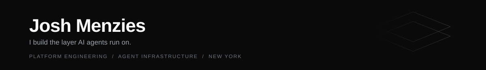

  

 

  
 

 

<picture>
  <source media="(prefers-color-scheme: dark)" srcset="https://raw.githubusercontent.com/jmenzies722/jmenzies722/output/snake-dark.svg" />
  <source media="(prefers-color-scheme: light)" srcset="https://raw.githubusercontent.com/jmenzies722/jmenzies722/output/snake-light.svg" />
  
</picture>

 

&nbsp;&nbsp;&nbsp;&nbsp;&nbsp;&nbsp;&nbsp;&nbsp;&nbsp;&nbsp;&nbsp;&nbsp;&nbsp;&nbsp;&nbsp;&nbsp;&nbsp;&nbsp;&nbsp;&nbsp;&nbsp;&nbsp;

Agent infrastructure on AWS, Kubernetes, and Terraform &nbsp;·&nbsp; MIT licensed &nbsp;·&nbsp; every tile above is a live repo

