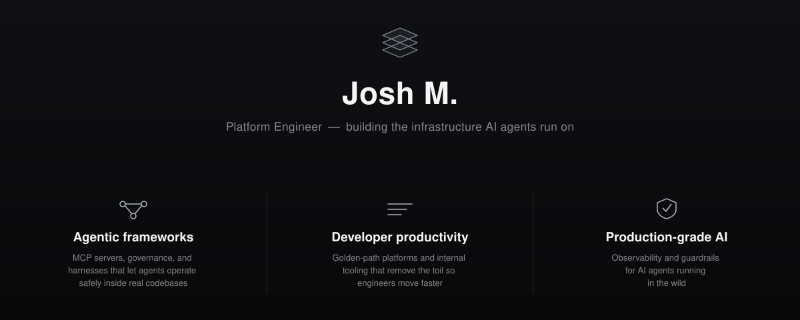

 

Platform engineer in New York. I build the layer AI agents actually run on — the
tooling, guardrails, and infrastructure that make them safe to operate in production
rather than impressive in a demo.

Everything below is something you can clone, run, or click.

---

## Things you can use right now

### 🧊 [CubeCoach](https://github.com/jmenzies722/cubecoach) · **[live demo →](https://cubecoach-three.vercel.app)**

Solve any Rubik's Cube and actually learn how. Interactive 3D cube, full beginner
layer-by-layer method, step-by-step coaching at every stage. The solver is verified
against exhaustive search, so the method it teaches is provably complete — it will
never walk you into a dead end.

`React` `Three.js` `WebGL`

### 🔄 [mcp-sync](https://github.com/jmenzies722/mcp-sync)

One MCP server set across Claude Code, Cursor, Warp, and Claude Desktop — from a
single canonical file. Detects silent config drift and unresolved env vars, the
failure mode where one tool quietly loses a server and you don't notice for weeks.
Zero dependencies, pure standard library.

`Python` `MCP`

### ☁️ [AWS Architect MCP](https://github.com/jmenzies722/aws-architect-mcp)

Turns an AI agent into an AWS solutions architect. Give it a goal; it selects a
reference pattern and emits production-grade Terraform, a scoped IAM policy, and a
cost estimate — instead of hallucinating an architecture from scratch.

`TypeScript` `MCP` `Terraform`

### 📊 [claude-max](https://github.com/jmenzies722/claude-max)

Scores your entire Claude Code setup 0–100 across nine dimensions, then fixes what
it finds. Built because "am I using this well?" had no honest answer.

`Shell` `Claude Code`

### 🧪 [Shua Labs](https://github.com/jmenzies722/shua-labs) · **[site →](https://shua-labs.vercel.app)**

Home for the free tooling above. Tools for running AI agents in production — safe,
observable, cheap to operate.

`Next.js` `TypeScript`

---

## What I'm working on

- **A local Kubernetes platform** — k3d, Helm, and ArgoCD, split into how the cluster
  is built and what runs on it, so the GitOps boundary is a real one
- **AWS DevOps Professional (DOP-C02)** — studied through a live multi-account lab
  rather than practice exams
- **Agent infrastructure** — MCP servers, registries, and drift detection for
  multi-agent setups that outgrow a single config file

---

## Stack

 

Build in the open &nbsp;·&nbsp; Own the layer

