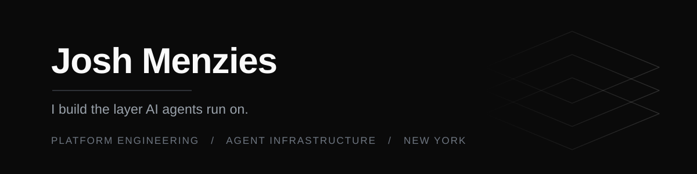
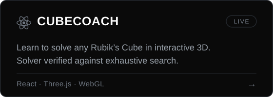
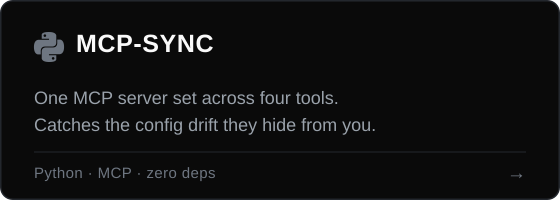
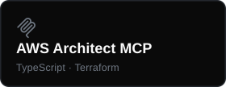
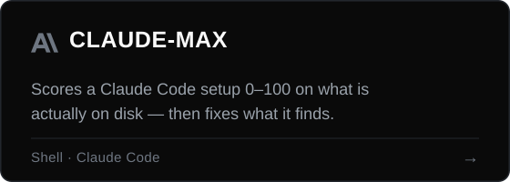
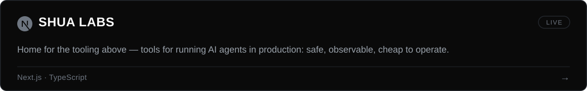

  

 &nbsp;  &nbsp; 

 
 

Every card links to a released repo &nbsp;·&nbsp; <a href="https://cubecoach-three.vercel.app">CubeCoach demo</a> &nbsp;·&nbsp; <a href="https://shua-labs.vercel.app">Shua Labs site</a>

 

---

## Contributions

<picture>
  <source media="(prefers-color-scheme: dark)" srcset="https://raw.githubusercontent.com/jmenzies722/jmenzies722/output/snake-dark.svg" />
  <source media="(prefers-color-scheme: light)" srcset="https://raw.githubusercontent.com/jmenzies722/jmenzies722/output/snake-light.svg" />
  
</picture>

 

---

## Stack

&nbsp;&nbsp;&nbsp;
&nbsp;&nbsp;&nbsp;
&nbsp;&nbsp;&nbsp;
&nbsp;&nbsp;&nbsp;
&nbsp;&nbsp;&nbsp;
&nbsp;&nbsp;&nbsp;
&nbsp;&nbsp;&nbsp;
&nbsp;&nbsp;&nbsp;
&nbsp;&nbsp;&nbsp;
&nbsp;&nbsp;&nbsp;
&nbsp;&nbsp;&nbsp;

 

Build in the open &nbsp;·&nbsp; Own the layer

