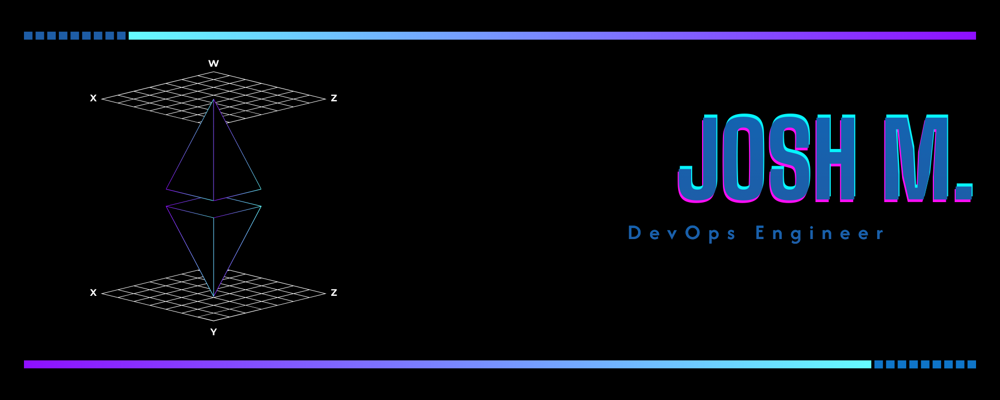

  

# Josh Menzies 💫 
**AI & Platform Engineer**  
_Cloud • DevOps • Reliability Engineering_

---

### 🧭 About Me  
Engineer focused on building **scalable, intelligent, and resilient systems** at the intersection of AI and cloud infrastructure.  
I design automation that learns, adapts, and keeps platforms running smoothly under real-world pressure.

---

### ⚙️ Core Stack  
`Python` · `TypeScript` · `Go` · `Bash`  
`AWS` · `GCP` · `Terraform` · `Kubernetes` · `Docker`  
`Jenkins` · `GitHub Actions` · `Datadog` · `Prometheus` · `Grafana`  
`OpenAI API` · `Hugging Face` · `TensorFlow`

---

### 🚀 Projects  
- **[WhisperNote](#)** — Voice-to-text with tone analysis _(Swift, CoreML)_  
- **[Opsy](#)** — AI-powered SRE assistant for reliability insights  
- **[CI/CD Pipeline](#)** — Fully automated infrastructure deployment  
- **[Velocity Cube](#)** — Interactive JavaScript engine experiment  
- **[Portfolio](https://shua-ai.vercel.app)** — My digital space for projects and experiments  

---

### 🌍 Connect  
[LinkedIn](https://www.linkedin.com/in/josh-m123456) · [Website](https://shua-ai.vercel.app)

---

### 💡 Mindset  
> “Automate what you can, understand what you must.” 
Constantly balancing simplicity, reliability, and innovation.
